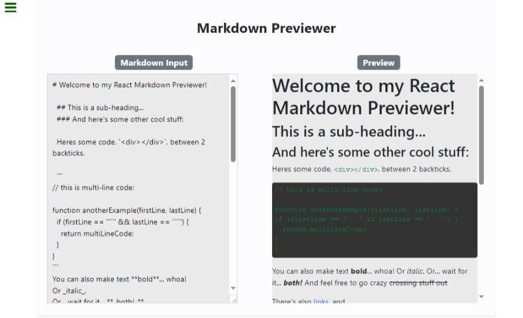

# MarkdownPreviewer

## Descripción
Este proyecto es una aplicación web simple que convierte contenido markdown a html.

## Tabla de Contenidos

- [Instalación y Uso](#Instalación-y-Uso)
- [Estructura de Archivos](#estructura-de-Archivos)
- [Tecnologías Utilizadas](#tecnologías-utilizadas)
- [Contacto](#contacto)
- [Capturas de Pantalla](#Capturas-de-Pantalla)

## Instalación y Uso
1. Clona el repositorio: `git clone <URL del Repositorio>`
2. Navega al directorio del proyecto: `cd <nombre del directorio>`
3. Instala las dependencias: `npm install market react-bootstrap styled-components`

 ## Estructura de Archivos
- `index.html`: Archivo principal HTML.
- `styledPreview.js`: Archivo de styled components.
- `main.jsx`: Archivo React principal.
- `App.jsx`: Archivo React con el codigo de la app.
- `.gitignore`: Archivo de configuración de Git.
- `README.md`: Documentación del proyecto.

## Tecnologías Utilizadas
- HTML
- Bootstrap
- JavaScript
- React
- Styled Components
- Market 
- Git

## Contacto
- Correo Electrónico: yoelagustindorta@gmail.com
- Twitter: @Djoelagustin

## Estado del Proyecto
Este proyecto está  finalizado.

## Capturas de Pantalla
